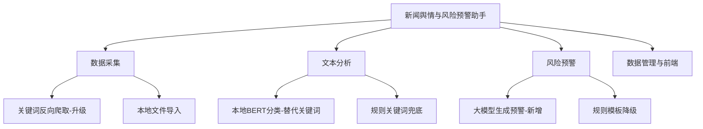
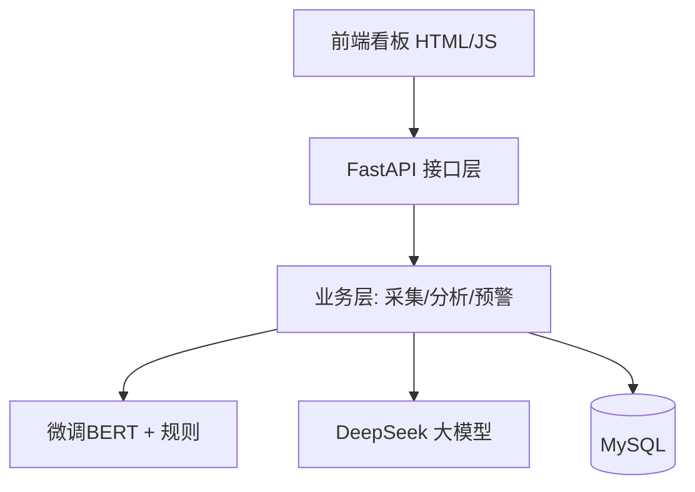
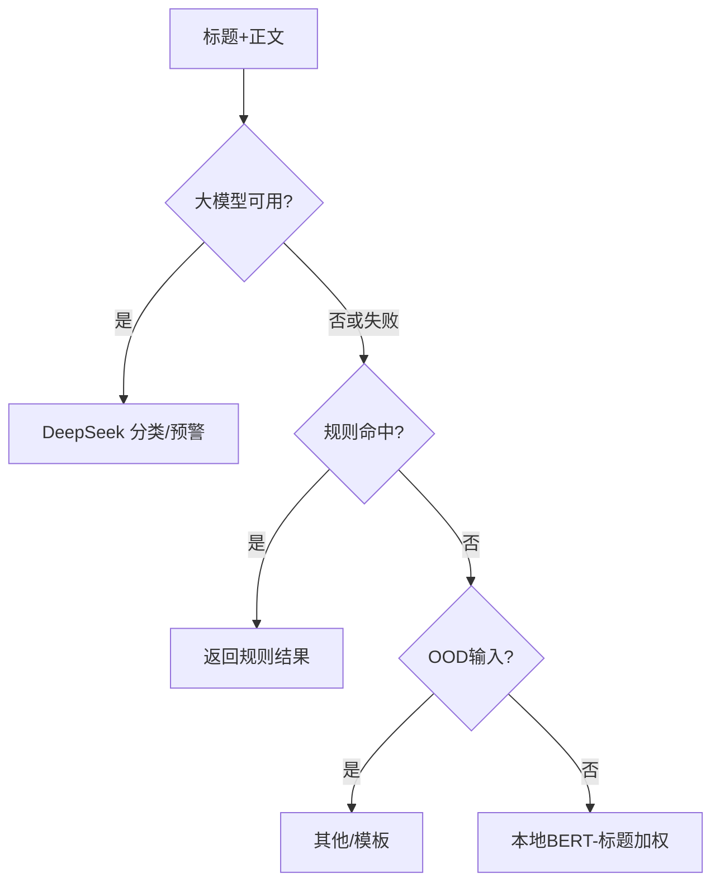

# 生产实习报告

## 实习目的

本次生产实习旨在通过参与真实项目开发，了解和熟悉企业研发人员的工作内容与岗位要求，熟悉研发团队的组建、分工与管理模式，并重点体会以敏捷 Scrum 为核心的研发流程、规范与标准。作为软件工程专业大三学生，已具备基本的编程与软件工程知识，但对企业研发岗位职责、团队与研发管理模式了解不足。通过在真实项目中强化软件分析、设计与编码训练，体会企业团队协作开发过程，熟悉协作工具、开发流程与规范，及时了解行业技术趋势，提升解决实际问题的专业能力，培养良好职业习惯与创新意识。

## 项目简介

项目名称为"面向本地农业的新闻舆情与风险预警助手"，目标是自动采集本地农业相关新闻，经文本分析与大模型研判后生成分级风险预警，辅助农业主体与管理部门及时防范气象灾害、病虫害、价格波动等风险。系统采用分层模块化架构，后端为 Python 3.13 + FastAPI + MySQL，采集层使用 requests + BeautifulSoup，文本分析融合 jieba 分词、TF-IDF 关键词、规则分类与微调 BERT（bert-base-chinese）本地模型，并接入 DeepSeek 大模型做零样本分类与预警文案生成、大模型不可用时自动降级本地模型与规则，前端为原生 HTML/JS 单页看板。团队按敏捷 Scrum 迭代推进，由产品经理、项目经理、技术经理（本人）与 coder 组成：产品经理负责需求定义与验收标准，项目经理把控迭代进度与资源协调，本人作为技术经理负责技术选型、架构设计与核心模块攻坚并指导 coder 落地，coder 负责具体功能编码。本人主导了三项技术升级：以本地微调 BERT 模型替代原有关键词分类、引入大模型做预警研判并设计降级容错、将采集由固定列表页升级为"关键词 + 搜索引擎反向爬取"。

## 个人承担工作

作为技术经理，本人主导系统由"纯关键词规则"向"本地模型 + 大模型 + 规则"三级智能架构的演进，完成技术选型、架构设计与关键代码攻坚，并制定懒加载、异常降级、接口解耦与代码评审规范指导 coder 实现。核心贡献为三项升级：其一，引入微调 BERT 本地模型替代原有关键词分类，并设计"规则优先→模型兜底"的推理门控；其二，引入 DeepSeek 大模型生成预警研判文案与零样本分类，并设计"大模型不可用时自动降级本地模型/规则模板"的容错链，兼顾效果与可用性；其三，将采集由两个固定网站列表页升级为关键词反向爬取，抽象出可插拔搜索引擎适配器与容错降级机制。

### 功能图



### 技术框架



### 流程图

采集到预警的整体流程：


分类与预警的三级降级逻辑：



### 项目效果图

前端看板（顶部操作区新增"关键词搜索采集"按钮与关键词输入框）：

```
┌── 面向本地农业的新闻舆情与风险预警助手 ───────────────┐
│ [刷新] [关键词:____] [关键词搜索采集] [立即更新新闻] [退出] │
│ 概览: 新闻 128 · 预警 27（高3/较高6/中18） ·  分类占比图  │
│───────────────────────────────────────────────────────│
│ 预警列表  标题            地区  产品  风险类型 评分 等级   │
│  河南发布小麦赤霉病气象预警 河南 小麦 病虫害  82  高风险  │
│  强降雨提示加强农田排涝     河南 —   气象灾害 63 较高风险 │
└───────────────────────────────────────────────────────┘
```

实测：默认百度被验证码拦截后经容错链自动切换 Bing，成功抓取新华网、今日头条等真实全文新闻并写入 `search_crawler_news.csv` 与数据库；模型评估经 `run_gating_eval.py` 输出，真实新闻离线准确率由 40% 提升至 100%，AgriCHN 短文本保持约 60%。

### 重要代码

搜索引擎可插拔适配器与容错链（`search_engines.py`）：

```python
class SearchEngine:                       # 适配器基类
    def search(self, query, limit=5) -> list[tuple[str, str]]:
        raise NotImplementedError

class MultiSearchEngine(SearchEngine):    # 按序尝试多引擎，返回首个有结果的
    def search(self, query, limit=5):
        for engine in self.engines:
            try:
                results = engine.search(query, limit=limit)
                if results:
                    return results
            except Exception:             # 被拦截则切换下一引擎
                continue
        return []
```

分类三级降级与本地模型推理门控（`classifier.py`）：

```python
def classify_news(title, content, use_llm=True):
    if use_llm:                                  # 一级: 大模型
        r = classify_news_with_llm(title, content)
        if r and r["category"] in VALID_CATEGORIES:
            return r["category"]
    return classify_news_offline(title, content) # 降级: 规则→本地模型

def classify_news_offline(title, content):
    rule = classify_news_rule(title, content)
    if rule != "其他":                            # 二级: 规则优先(真实新闻更可靠)
        return rule
    if not is_ood(title, content):               # OOD 跳过模型
        r = classify_with_confidence(title, content)   # 三级: 本地BERT(标题加权)
        if r and r["category"] in VALID_CATEGORIES:
            return r["category"]
    return "其他"
```

大模型预警文案生成，失败时保留规则模板（`llm_enricher.py`）：

```python
def enrich_warning_with_llm(record):
    if not LLM_CONFIG.enabled:
        return record                    # 未启用则用规则模板文案
    parsed = _parse_llm_json(_call_llm(_build_context(record)))
    if parsed and parsed.get("reason"):  # 成功才覆盖，失败静默降级
        record["reason"] = parsed["reason"]
        record["suggestion"] = parsed.get("suggestion", record["suggestion"])
    return record
```

### 主要程序接口 / 接口函数

对外 REST 接口（`data_management/app.py`）：

```
POST /api/crawl/search?limit_per_query=5&keywords=   关键词反向爬取→分析→预警→入库
POST /api/crawl/update?limit_per_source=5            固定列表页采集（与上共用下游）
GET  /api/news    /api/warnings    /api/charts/*      检索与看板数据
```

核心 Python 接口函数：

```
search_engines.build_engine_chain(primary, fallbacks) -> SearchEngine
SearchEngine.search(query, limit) -> list[(url, title)]
keyword_query.build_search_queries(max_queries) -> list[{query,region,risk_type}]
NewsCrawler.crawl_by_queries(queries, engine, limit_per_query) -> CrawlResult
classifier.classify_news(title, content, use_llm=True) -> str      # 分类主入口
classifier.classify_news_offline(title, content) -> str            # 离线门控链路
inference.classify_with_confidence(title, content) -> {category,confidence,scores}
warning_generator.generate_warnings(news_items, price_changes) -> list  # 评分+预警
llm_enricher.enrich_warning_with_llm(record) -> record             # 大模型预警文案
```

## 个人遇到的主要问题及解决方法

作为技术经理，攻坚中最棘手的是百度对脚本请求直接跳转"百度安全验证"验证码页、移动端结果又为 JS 动态渲染，静态爬取无法获取结果，搜狗与 360 相关性虽好但请求数次后即被限流。为此我没有让 coder 硬钢单一引擎，而是把采集抽象为可插拔的 `SearchEngine` 适配器并设计"主引擎 + 备用引擎"容错链，主引擎被拦截时自动降级到较稳定的必应，实测百度失败后落到 Bing 仍能持续产出新闻，兼顾了默认引擎与系统可用性；结果多为跳转链，则统一跟随重定向解析真实地址并加域名黑名单过滤聚合页。第二个问题是引入本地 BERT 模型后，其在真实新闻上的准确率仅 40%、反而低于原关键词规则的 73%，我用评估数据定位到根因是训练数据（AgriCHN 短句）与推理数据（完整新闻）分布不匹配，遂将离线链路由"模型优先"改为"规则优先→模型兜底"，对纯英文/符号等 OOD 输入直接跳过模型，并对模型输入做标题加权贴近训练分布，用自建评估脚本量化验证后真实新闻离线准确率提升到 100%、短文本仍保持约 60%。第三个是大模型接入需兼顾成本与稳定，我设计了低风险条目跳过大模型、失败静默降级规则模板的容错策略，保证任何情况下预警都能产出。此外还统一处理了跨模块 `sys.path` 导入、GB2312/UTF-8 编码探测、单源失败不中断整批等工程规范，并为后续用大模型自动标注真实新闻重训模型搭好了流水线。

## 个人实习体会及收获

这次实习让我以技术经理的角色第一次在接近真实的工程语境中主导一条技术演进从选型、设计到攻坚落地的完整过程，也真正理解了敏捷 Scrum "小步快跑、用户故事驱动、每日站会同步、迭代评审验收"的价值，以及产品、项目、技术三类岗位如何以需求与接口为契约协同——产品经理定义"做什么"、项目经理把控"何时做完"、技术经理决定"怎么做好"、coder 负责实现，边界清晰又彼此咬合。技术上我体会到企业更看重可维护与健壮而非炫技：面对百度反爬这类不可控外部依赖，正确做法是抽象可插拔接口并优雅降级而非把逻辑写死；面对模型效果不达标，先用数据定位根因、再用最小改动拿到可量化提升，比盲目换更大的模型更有效；引入大模型也必须配套降级与成本控制才能上生产。带 coder 落地的过程让我意识到清晰的接口约定、代码评审与统一规范对团队效率的决定性作用。除了架构与编码能力，我对研发管理"需求—设计—编码—评审—验收"的完整闭环有了直观认识，也更清楚自己在系统设计、技术沟通与团队协调上的努力方向，为今后的学习与就业打下了更扎实的基础。
